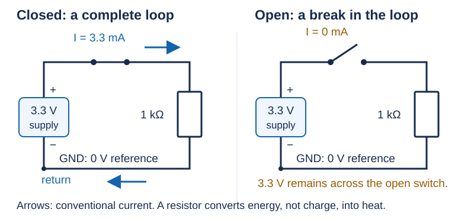

# 01 — Charge, energy, and a complete circuit

[Concept index](README.md) · [Day 1 lab](../DAILY_STUDY_AND_LAB_PLAN.md#day-1--system-map-safety-and-a-green-software-baseline)

**Question:** What actually moves, and what does a component “use up”?

## Start with the physical picture

Matter contains positive and negative **electric charge**. Electrons carry
negative charge; some electrons in a metal can move through it. The wire
already contains these carriers before you connect a supply. Charge is a
property of matter, not another name for energy.

An **electric field** exerts a force on charge. A powered source maintains a
voltage difference between its terminals; the field established in a connected
circuit drives an average movement of charge. That flow is **current**.
This is the starting point of the
[charge model](https://openstax.org/books/college-physics-2e/pages/18-1-static-electricity-and-charge-conservation-of-charge).

Schematic arrows show **conventional current**: the direction positive charge
would move. Electron drift in a metal is opposite that arrow. Use conventional
current consistently; you do not need to track individual electrons.



*Ideal DC model: an open circuit can have voltage even though its current is zero.*

## Energy is transferred; charge is not consumed

A source supplies electrical **energy**, measured in joules (`J`). A resistor
converts electrical energy into heat; an OLED also produces light. Neither
destroys the charge flowing through it.

At steady state in this one-loop circuit, the current entering the resistor
equals the current leaving it. There is no “used-up current” on the return wire.

**Voltage** tells you the energy change per unit charge between two points:
`1 volt = 1 joule per coulomb`. A coulomb (`C`) is a unit of charge.
See [potential difference](https://openstax.org/books/college-physics-2e/pages/19-1-electric-potential-energy-potential-difference).

**Example:** If `0.002 C` passes through a resistor with `3.3 V` across it,
the energy converted is `3.3 J/C × 0.002 C = 0.0066 J`. The same amount of
charge enters and leaves; its electrical potential energy changes.

## Ground and rails are names for connections

A **node** is a set of directly joined conductors treated as one electrical
point. **GND** names the node we choose as the `0 V` reference. It is not a
drain that swallows current, nor automatically Earth or the brass frame.

A **power rail** is a shared supply connection, such as the controller's
`3.3 V` output feeding several peripherals. Each peripheral also needs a return.

```text
3.3 V rail ──┬── OLED ──┬── GND return
             └── mic ───┘
```

*The two devices are branches between the same supply and return nodes.*

For your prototype, think **source → load → return → source** before thinking
about code. A signal wire describes information, but it is still an electrical
connection referenced to another node. Follow the daily lab for wiring and
power limits; this picture is not a replacement wiring guide.

## Predict before opening the answer

With the switch open, does “no current” prove that every point is at `0 V`?

<details>
<summary>Answer</summary>

No. In the ideal drawing, the source still maintains `3.3 V`; that voltage
appears across the open switch. An open path stops steady current, not the
existence of voltage. Disconnect power before changing wiring.

</details>

**Next:** [voltage, current, resistance, and power](02-voltage-current-resistance-and-power.md).
For more detail, see [Lesson 01](../../edu/fundamentals/01-units-charge-voltage-current-power-energy-heat.md).
