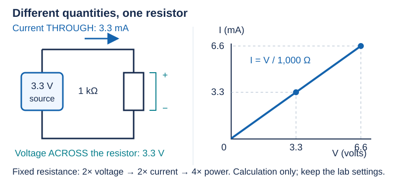

# 02 — Voltage, current, resistance, and power

[Concept index](README.md) · [Day 2 lab](../DAILY_STUDY_AND_LAB_PLAN.md#day-2--voltage-current-resistance-power-and-units)

**Question:** How do the physical ideas become useful calculations?

Read [charge and complete circuits](01-charge-energy-and-circuits.md) first
if those words are still unfamiliar.

## Four quantities, four different questions

| Quantity | What it asks | Unit |
| --- | --- | --- |
| Voltage `V` | Energy change **per charge**, between which two points? | volt, `J/C` |
| Current `I` | How much charge passes a point **per second**? | ampere, `C/s` |
| Resistance `R` | For this resistor, how much voltage is needed for a given current? | ohm, `Ω = V/A` |
| Power `P` | How much energy is transferred **per second**? | watt, `J/s` |

`Δ` means “change in,” so `I = ΔQ/Δt` gives the **average current** over an
interval: charge moved divided by elapsed time. For steady current, this is
also its value at every instant. For an **ohmic resistor at fixed conditions**, measurements follow
`V = IR`: voltage and current change in proportion. This is a material model,
not a rule that every component has one constant resistance.
[Ohm's law](https://openstax.org/books/college-physics-2e/pages/20-2-ohms-law-resistance-and-simple-circuits)
describes that relationship.



*One resistor, fixed temperature: doubling voltage doubles current. The graph is a calculation, not an instruction to raise the lab supply.*

## Why a resistor heats up

The field drives carriers through the material. Interactions with its atomic
structure transfer energy to the material's thermal motion. Charge is not
lost; electrical energy becomes heat. The resistor's resistance and its
**power rating** therefore answer different questions.

For steady voltage and current, the units explain the power equation:

```text
P = V × I = (joules/coulomb) × (coulombs/second) = joules/second
```

Using `V = IR`, you can also write `P = I²R` or `P = V²/R` for that resistor.
These are substitutions, not three unrelated formulas to memorize.

## One complete example

Use the nominal values for a prediction; the lab uses your measured values.

```text
R = 1 kΩ = 1,000 Ω
I = 3.3 V / 1,000 Ω = 0.0033 A = 3.3 mA
P = 3.3 V × 0.0033 A = 0.01089 W ≈ 10.9 mW
Energy in 10 s = P × time = 0.1089 J
```

`k` means ×1,000; `m` means ÷1,000; `µ` means ÷1,000,000. Convert prefixes
before multiplying. A `¼ W` resistor's rating is not its actual dissipation;
here the predicted dissipation is much smaller. Temperature also depends on
how well heat escapes, not only on watts.

## The engineering decision

A `20 mA` supply **current limit** is a ceiling, not a command to push `20 mA`
through the resistor. This load should draw about `3.3 mA`. If a supply reaches
its limit, it generally reduces voltage; `3.3 V` may no longer describe the
actual circuit. Stop and investigate instead of raising the limit.

## Predict before opening the answer

At the same `3.3 V`, changing `1 kΩ` to `2 kΩ` does what to current and power?

<details>
<summary>Answer</summary>

Both halve: `I = 1.65 mA`, and `P ≈ 5.45 mW`. Conversely, doubling voltage
across the original resistor doubles current but **quadruples power**, because
`P = V²/R`.

</details>

**More depth:** [Lesson 01](../../edu/fundamentals/01-units-charge-voltage-current-power-energy-heat.md).
