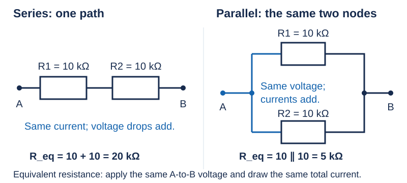
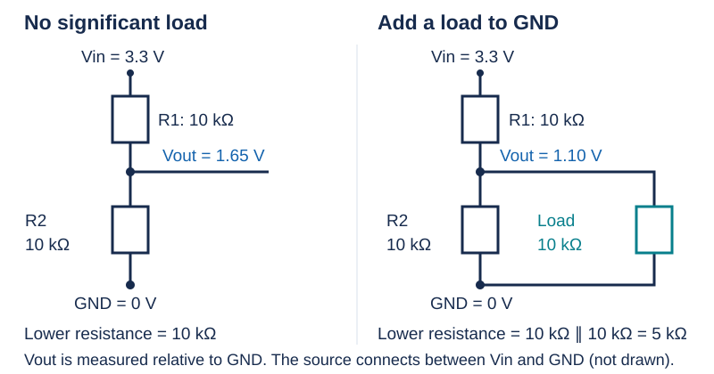

# 03 — Series, parallel, rails, and divider loading

[Concept index](README.md) · [Day 3 lab](../DAILY_STUDY_AND_LAB_PLAN.md#day-3--series-parallel-kvl-kcl-and-divider-loading)

**Question:** Where do equivalent resistance and the divider formula come from?

Start with [Ohm's law and units](02-voltage-current-resistance-and-power.md).

## Two conservation rules

**KCL — Kirchhoff's current law:** total current entering a node equals total
current leaving it. This is charge accounting; include every branch, including
a capacitor branch when present.

**KVL — Kirchhoff's voltage law:** voltage rises and drops around a closed
loop add to zero in our small, lumped-circuit model. This is energy-per-charge
accounting. A `3.3 V` source rise can balance drops of `2.2 V` and `1.1 V`.

A **rail** is a shared supply node. Its incoming current is the sum of the
branch currents, not necessarily the current at every point along the wire:

```text
I_rail → ●──→ I_OLED
         ├──→ I_mic
         └──→ I_controller

I_rail = I_OLED + I_mic + I_controller
```

*Each load also returns current to the source through the GND network, omitted here.*

## Equivalent means “the same from two terminals”

Replace a resistor network with one resistor that draws the **same total
current at the same applied voltage**. Thus `R_eq = V_AB / I_total`, where
`V_AB` is the voltage between terminals A and B. Internal branch currents need
not be equal: the equivalence is what the source sees.



*Series means one unbranched path; parallel means the same two end nodes. Physical placement on a breadboard is not the definition.*

<details>
<summary>Derive both results instead of memorizing them</summary>

**Series:** the current `I` is the same through both resistors. KVL gives
`V_AB = IR1 + IR2 = I(R1 + R2)`. Divide by `I`:
`R_eq = R1 + R2`.

**Parallel:** both branches have voltage `V_AB`. Ohm's law and KCL give
`I_total = V_AB/R1 + V_AB/R2`. Substitute `I_total = V_AB/R_eq` and cancel
nonzero `V_AB`:

```text
1/R_eq = 1/R1 + 1/R2
R_eq = (R1 × R2)/(R1 + R2)   [two resistors only]
```

`R1 ∥ R2` means “the equivalent resistance of R1 in parallel with R2.”
For two `10 kΩ` branches, `R_eq = 5 kΩ`: twice the current can flow at the
same voltage. With positive finite resistances, parallel resistance is below
either branch resistance.

</details>

## A divider changes when you connect a load

With negligible load, the two resistors carry one current:
`I = Vin/(R1 + R2)`. The output is the voltage across the lower resistor:
`Vout = IR2 = Vin × R2/(R1 + R2)`.



*The new load shares both nodes with R2, not with R1.*

Loaded result: `Vout = 3.3 × 5/(10 + 5) = 1.10 V`. The top resistor carries
`220 µA`, which splits into `110 µA` through R2 and `110 µA` through the load.
KCL still balances. The unloaded current was only `165 µA`.

**Prototype lesson:** a divider can set a sensing voltage, but it does not
hold that voltage against arbitrary module current. Do not use one to power
the OLED or controller.

## Predict before opening the answer

If the load is removed, does the output return to `1.65 V` or stay at `1.10 V`?

<details>
<summary>Answer</summary>

It returns to `1.65 V` in this ideal steady-state model. Removing the load
restores `10 kΩ` as the lower resistance. This is a paper prediction; unplug
power before changing the lab wiring.

</details>

**More depth:** [Lesson 02](../../edu/fundamentals/02-dc-circuits-ohm-kirchhoff-series-parallel.md),
including unequal resistors; textbook reference:
[series and parallel networks](https://openstax.org/books/college-physics-2e/pages/21-1-resistors-in-series-and-parallel).
