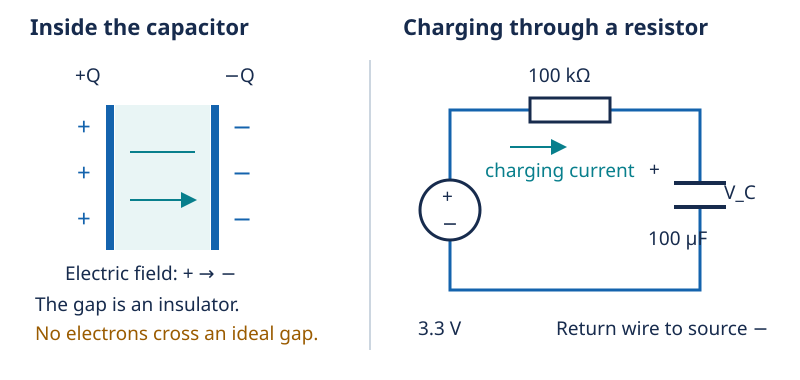
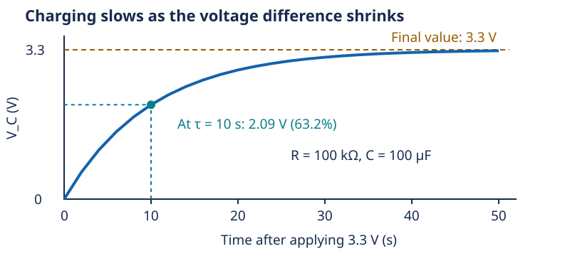

# Capacitors: electric fields and time

[Concept index](README.md) · [Day 4 lab](../DAILY_STUDY_AND_LAB_PLAN.md#day-4--components-and-an-observable-rc-time-constant)

Optional reading · about 5 minutes · builds on voltage, current, and resistance.

## The physical idea

A capacitor has two conductors separated by an insulator, the **dielectric**.
Charging moves electrons through the external wires: one conductor gains
electrons while the other loses them. The resulting charge separation creates
an electric field. Electrons do **not** travel through an ideal dielectric.



For a fixed capacitance:

```text
Q = C × V            charge = capacitance × voltage
i = C × dV/dt        current = capacitance × rate of voltage change
E = ½ × C × V²       stored energy, in joules
```

`C` is measured in farads (F); `Q` in coulombs. Without calculus, read the
middle equation as `average current = C × ΔV / Δt` over a time interval.
More current changes the voltage faster; more capacitance makes the same
current change it more slowly. An ideal capacitor carries no steady DC
current once its voltage stops changing. Real ones leak a little.

A capacitor stores electric-field energy; a battery stores energy through
electrochemical reactions. Neither creates energy, and their discharge
behavior is different.

## Why the charging curve bends

At the start, an uncharged capacitor has `V_C = 0`. Most of the source voltage
is across the resistor, so current is largest. As `V_C` rises, resistor voltage
and current fall: `i = (V_source − V_C) / R`. Charging therefore slows down.



The **time constant**, `τ` (tau), is `R × C`. Ohms times farads gives seconds.
After one `τ`, an initially uncharged capacitor reaches about **63%** of its
final voltage—not 63% more on every interval.

## One worked example

Day 4 uses `100 kΩ` and `100 µF` with a `3.3 V` source:

```text
τ = 100,000 Ω × 0.000100 F = 10 seconds
V_C(10 s) = 3.3 × (1 − e⁻¹) ≈ 2.09 V
V_C(50 s) = 3.3 × (1 − e⁻⁵) ≈ 3.28 V
```

This prediction assumes constant supply voltage, an initially discharged
capacitor, and negligible loading. Component tolerance, leakage, and the
voltmeter can change your observations.

## In your prototype

A nearby **decoupling capacitor** supplies some current during brief load
changes, reducing rail dips while the supply responds. Short connections
matter because real wires also resist changing current. It cannot compensate
for an inadequate supply indefinitely.

Power off does not guarantee zero stored charge. Check polarity and voltage
rating, and follow the existing Day 4 discharge procedure; never short the
capacitor with a wire.

<details>
<summary>Check yourself: if resistance doubles but capacitance stays the same, what changes?</summary>

The time constant doubles: charging takes twice as long to reach each
fraction of its final voltage. The ideal final voltage remains 3.3 V.

</details>

Go deeper: [Lesson 03: capacitors, RC timing, and the existing battery-free lab](../../edu/fundamentals/03-components-rc-diodes-mosfets-converters.md#capacitors).
