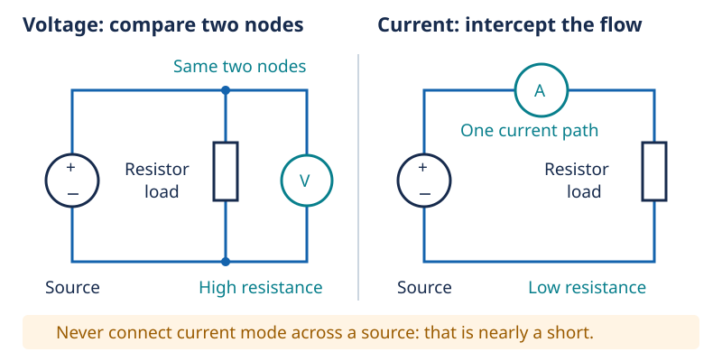
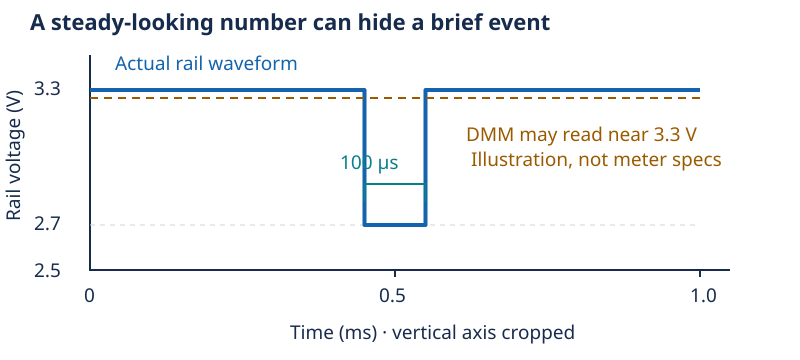

# Measurement: your meter joins the circuit

[Concept index](README.md) · [Day 5 lab](../DAILY_STUDY_AND_LAB_PLAN.md#day-5--measurement-as-a-controlled-experiment)

Optional reading · about 5 minutes · builds on parallel circuits and dividers.

## The physical idea

Measuring requires an interaction. A voltmeter draws a small current; a
current meter introduces a small voltage drop. Your instrument observes a
slightly changed circuit, not a circuit it magically leaves untouched.

A **voltmeter** compares two nodes, so it connects in **parallel**. Its high,
but finite, input resistance minimizes the extra current.

An **ammeter** measures current through itself, so it goes in **series**.
Its low internal resistance minimizes the added voltage drop, called
**burden voltage**. Low does not mean zero.



These drawings explain topology; they are not instructions to change a live
circuit. Day 5's current measurement is optional. Power off before moving
leads, verify the manual, fuse, jack, and range, and return the red lead to
the voltage jack afterward. **Never put current mode across a source.**

## One worked example: the meter loads a divider

Two `10 kΩ` resistors across `3.3 V` predict `1.65 V` at their midpoint.
Suppose a voltmeter has **1 MΩ input resistance**—an illustrative value,
not a specification for your meter. Connecting it from midpoint to GND
puts that resistance in parallel with the lower resistor:

```text
R_lower = 10,000 Ω || 1,000,000 Ω ≈ 9,901 Ω
V_measured = 3.3 × 9,901 / (10,000 + 9,901) ≈ 1.642 V
```

The roughly `8 mV` shift is a circuit effect, even with an otherwise perfect
meter. A plausible unloaded voltage still does not prove a divider can power
a module. Here `||` means “in parallel”; GND is the circuit's voltage
reference, not necessarily an earth connection.

## Digits are not the same as knowledge

| Word | What it tells you |
| --- | --- |
| Resolution | The smallest displayed change, such as 0.001 V. |
| Accuracy | How close the result is to the actual value under specified conditions. |
| Repeatability | How closely repeated readings agree under the same conditions. |

A meter can repeatedly show `3.300 V` while having a systematic error. For a
**toy accuracy bound** of ±1% of reading, `3.30 V` means approximately
`3.267–3.333 V`; your meter's real specification may also include counts,
range, and temperature terms.



A normal DMM reading can miss a fast rail dip because its measurement and
display updates average or sample over time. More displayed digits do not
make it a fast waveform recorder.

## In your prototype

Use your owned meter for polarity, steady voltage, and unpowered resistance
checks. Record **where**, **relative to what**, **in which mode**, and **under
what load** you measured. If the MCU resets despite a plausible reading,
mark fast-transient behavior unknown; this page does not require another tool.

<details>
<summary>Check yourself: ten identical voltage readings prove what—and not what?</summary>

They support repeatability under those conditions. They do not by themselves
prove accuracy, negligible meter loading, or absence of brief voltage dips.

</details>

Go deeper: [Lesson 05: measurement methods and safe connection procedures](../../edu/fundamentals/05-measurement-dmm-supply-scope-logic-analyzer.md).
