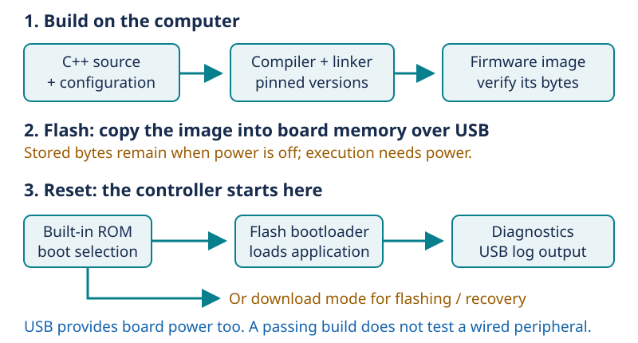

# Day 6 — From code to a running controller

[Concept index](README.md) · [Day 6 lab](../DAILY_STUDY_AND_LAB_PLAN.md#day-6--exact-part-evidence-and-bare-controller-boot)

## The physical idea

Your C++ source is a description, not something a chip can directly execute.
The compiler translates it into machine instructions. A linker places code
and data into an image; flashing stores the image in the board's nonvolatile
memory. **Nonvolatile** means it retains information without power. RAM is
working memory and does not retain the running program's state after power is
removed.

Physically, transistor circuits implement the logic that moves and transforms
bits. A clock coordinates operations, and the power supply provides the energy
for switching. Correct instructions cannot compensate for a missing supply or
an unstable reset signal. Think of firmware and hardware as two sides of one
execution environment—not as independent products.



*Building changes a file on your computer. Flashing changes memory on the
board. Resetting starts execution; monitoring only observes its messages.*

## The engineering idea: isolate each stage

A successful build proves that the selected source and tools can produce an
image. A matching checksum proves that bytes match a recorded image. Neither
proves that an OLED is correctly wired or that a microphone works.

At reset, the chip starts with built-in ROM code. Its boot selection can lead
to the download path or to the flash bootloader and application. That is why
the onboard BOOT control is different from your application's action button:
the recovery path must work before your application runs.

Use the project's scripts for the exact image, addresses, and boot procedure;
this sketch is a mental model, not a replacement flashing command.

## One small example

A **hypothetical** `512 KiB` application needs:

```text
512 × 1,024 = 524,288 bytes
524,288 × 8 = 4,194,304 bits
```

That is storage capacity, not the amount of RAM it needs or how fast it runs.
Flash partitions also reserve space for other content, so total flash size is
not identical to available application space.

## In your pocket prototype

The first target is the bare controller producing a stable **offline
diagnostic log**, not a complete AI conversation. Missing peripherals are
expected. Add one tested peripheral at a time using the
[USB quickstart](../../docs/PROTOTYPE_QUICKSTART.md). No extra parts or cloud
account are needed for that first result.

**Predict:** The image checksum matches, but the board repeatedly resets. Has
the checksum proved that the power and wiring are good?

<details>
<summary>Answer</summary>

No. It verified image identity only. Reset logs and the bare-board setup help
separate application faults, power problems, and attached-peripheral problems.
Keep each claim tied to what its test actually observes.

</details>

For more: [Lesson 04 — Boards, pinouts, and datasheets](../../edu/fundamentals/04-boards-schematics-datasheets-and-connectors.md).
