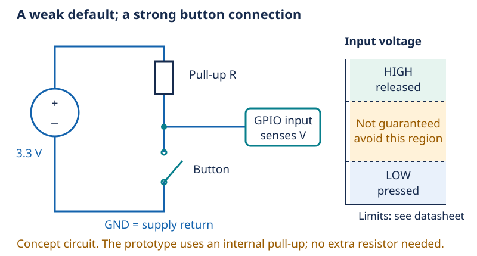

# Day 7 — How a button becomes a bit

[Concept index](README.md) · [Day 7 lab](../DAILY_STUDY_AND_LAB_PLAN.md#day-7--digital-logic-and-the-action-button)

## The physical idea

A GPIO input does not receive the abstract value `true`. It senses a voltage
relative to the controller's ground. Voltages below the guaranteed LOW limit
count as LOW; voltages above the HIGH limit count as HIGH. The region between
those limits has no guaranteed interpretation. A digital input is therefore
an analog circuit with a digital interpretation.

An input draws little current, but it still has capacitance and leakage. If
left disconnected, nearby electric fields and tiny leakage currents can change
its voltage. That is a **floating input**: its reading is not a reliable
default, even if it happens to look stable today.



*The resistor sets the released state. Closing the button provides a much
lower-resistance path to ground. Its current returns through the supply.*

## The engineering idea: choose a default

A **pull-up** is a weak resistive connection to the positive logic supply.
With the button open, it brings the input near 3.3 V. With the button closed,
the switch holds the input near ground and the resistor limits current.
The result is **active-low**: pressed means LOW, so firmware interprets
`pressed = !pin_level`.

A push-pull output is different: it actively drives HIGH or LOW. Do not connect
an output configured HIGH directly to a button that shorts it to ground. The
GPIO must be configured as an input for this circuit. Likewise, do not feed
5 V into a 3.3 V controller GPIO.

Mechanical contacts can bounce—briefly opening and closing several times
during one press. Debouncing filters those rapid transitions so one physical
press becomes one application event. A pull-up fixes the default voltage;
debouncing fixes repeated transitions. They solve different problems.

## One small example

For an **illustrative external** 10 kΩ pull-up:

```text
button released: almost no steady input current
button pressed:  I = 3.3 V / 10,000 Ω = 0.33 mA
```

This is an Ohm's-law example, not an instruction to add that resistor. The
prototype firmware already enables GPIO10's internal pull-up, whose resistance
is not assumed to be 10 kΩ.

## In your pocket prototype

GPIO10 is the external action button; the onboard GPIO9 BOOT button is for
recovery. Wire only with USB disconnected, following the
[quickstart](../../docs/PROTOTYPE_QUICKSTART.md#add-the-button-and-oled).
A four-leg tactile switch often contains two permanently connected pairs:
identify which contacts actually switch before using them.

**Predict:** If the pull-up is removed while the button is released, must the
input read LOW?

<details>
<summary>Answer</summary>

No. Without another bias path it floats. An open circuit is not a connection
to ground, and “no current” does not mean “zero voltage.”

</details>

For more: [Lesson 07 — GPIO, pull resistors, and boot straps](../../edu/fundamentals/07-digital-logic-gpio-pullups-boot-straps.md).
