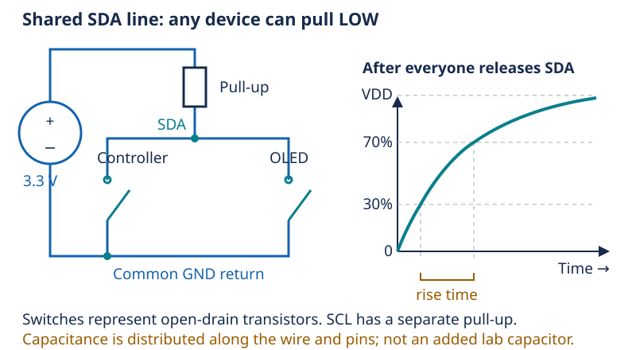

# Day 8 — Why two I2C wires need resistors

[Concept index](README.md) · [Day 8 lab](../DAILY_STUDY_AND_LAB_PLAN.md#day-8--i2c-and-the-oled)

## The physical idea

The OLED receives commands and pixel data over I2C: **SDA** carries data and
**SCL** provides timing. Both are shared open-drain signals: a device can pull
a line LOW or release it. A pull-up resistor restores HIGH. This differs from
a push-pull output, which actively drives both levels. Nobody should fight a
LOW by actively forcing HIGH on this bus.

Wires and input pins store a small amount of charge: together they act like a
capacitor. After release, the resistor must charge that capacitance, so the
voltage rises gradually. This is the same RC behavior as
[Day 4](04-capacitors-and-time.md), now happening much faster.



*One signal line is shown; SCL also needs its own pull-up. “Two wires” excludes
the supply and common ground connections.*

## The engineering idea: timing is a voltage requirement

A receiver needs the line to become reliably HIGH before it samples the bit.
Longer wiring generally adds capacitance; more capacitance means a slower
rise for the same resistance. Reducing resistance speeds the rise but increases
the current a device must sink while holding LOW. So “use the smallest
resistor” is not a complete design rule.

For I2C's 30%–70% rise-time definition, `t_r ≈ 0.847 × R × C`.
Fast-mode at 400 kHz allows up to 300 ns. These requirements come from the
[NXP I2C specification, sections 6 and 7](https://www.nxp.com/docs/en/user-guide/UM10204.pdf).

## One small example

Assume **illustrative**, not measured, values:

```text
R = 10 kΩ; C = 100 pF
t_r ≈ 0.847 × 10,000 × 100 × 10⁻¹² seconds
    ≈ 847 ns
```

That exceeds the 400 kHz rise-time limit. Short working wires and an address
response are useful observations, but neither measures the actual rise time.
Do not add resistors blindly: the OLED carrier may already contain pull-ups,
and additional ones would be in parallel.

## In your pocket prototype

The current source uses GPIO21/SDA and GPIO20/SCL and tries OLED addresses
`0x3C` and `0x3D`. An address is a digital identifier, not a voltage. Treat the
[quickstart pin map](../../docs/PROTOTYPE_QUICKSTART.md#add-the-button-and-oled)
as the wiring instructions.

An **ACK** is the addressed device's acknowledgement. It proves a response at
that address, not that every pixel works. The all-on/all-off test adds that
different observation. With no display connected, headless operation keeps
the rest of the diagnostic program running.

**Predict:** If capacitance doubles but resistance stays the same, what
happens to rise time?

<details>
<summary>Answer</summary>

It approximately doubles because `t_r` is proportional to `RC`. Firmware
cannot remove that electrical delay by calling the same write function again.

</details>

For more: [Lesson 08 — I2C transactions and OLED diagnosis](../../edu/fundamentals/08-i2c-and-the-oled.md).
