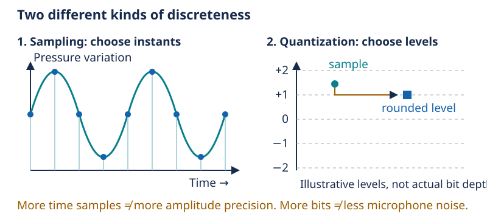
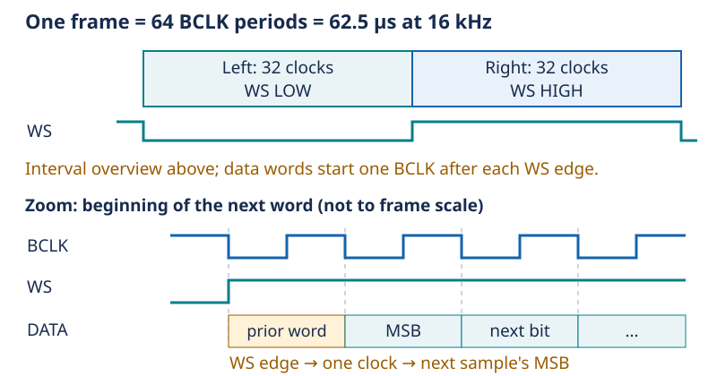

# Day 9 — From air pressure to audio numbers

[Concept index](README.md) · [Day 9 lab](../DAILY_STUDY_AND_LAB_PLAN.md#day-9--i2s-clocks-and-microphone-input)

## The physical idea

Sound is a changing air pressure. Inside a MEMS microphone, pressure moves a
tiny diaphragm; electronics turn that movement into an electrical signal and
then numbers. **Sampling** chooses when to measure. **Quantization** represents
each measured value using one of a finite set of codes. Neither requires you
to design the microphone's internal converter.



*Dots show selected instants. Amplitude levels are deliberately coarse to make
rounding visible; this is not the microphone's actual resolution.*

More samples per second preserve faster changes. More bits per sample provide
more amplitude codes. These are different axes of detail. More bits do not
remove microphone noise, and a 32-bit storage container does not imply 32 bits
of useful acoustic information.

**Aliasing** means different continuous waveforms can produce identical
samples. At 16,000 samples/s, the theoretical Nyquist boundary is 8,000 Hz;
the usable band must stop below it. Filtering before the relevant sampling
or downsampling step limits frequencies that would fold into the wanted band.
Once aliased, those components cannot be uniquely separated from the wanted
signal using those samples alone.

## The engineering idea: numbers need a transport format

I2S is a timed stream, not the OLED's addressed I2C bus. BCLK advances the bit
positions, WS identifies left/right timing, and SD carries microphone data.
There is no per-sample acknowledgement or address scan.



*The controller consumes the selected left channel. The wire still carries
two 32-clock intervals per frame; mono capture does not halve this clock.*

The owned INMP441 supplies 24-bit samples using 64 clocks per frame. Its L/R
selection chooses the active channel; it is not an I2C address.
See the [TDK INMP441 datasheet](https://invensense.tdk.com/wp-content/uploads/2015/02/INMP441.pdf).
Standard I2S places a word's most-significant bit one BCLK period after the WS
change, per the [NXP I2S specification](https://www.nxp.com/docs/en/user-manual/UM11732.pdf).

## One small example

```text
sample interval = 1 / 16,000 = 62.5 µs
BCLK = 16,000 frames/s × 2 intervals/frame × 32 clocks/interval
     = 1,024,000 clocks/s = 1.024 MHz
```

The 24 meaningful data bits do not replace the 32-clock transport interval.

## In your pocket prototype

The [microphone-only lab](../../docs/PROTOTYPE_QUICKSTART.md#add-the-microphone)
uses WS/GPIO1, BCLK/GPIO2, and microphone data/GPIO4. Serial min/max and RMS
levels should change with speech. RMS summarizes signal magnitude; it is not
a calibrated sound-pressure reading. Keep the amplifier disconnected.

**Predict:** Does receiving changing numbers prove that the sample rate and
bit alignment are correct?

<details>
<summary>Answer</summary>

No. It is evidence of changing captured data. Configuration checks and, when
available, timing measurements test different claims. Misaligned samples can
still vary.

</details>

For more: [Lesson 09 — Digital audio timing and sampling](../../edu/fundamentals/09-i2s-sampling-and-digital-audio.md).
