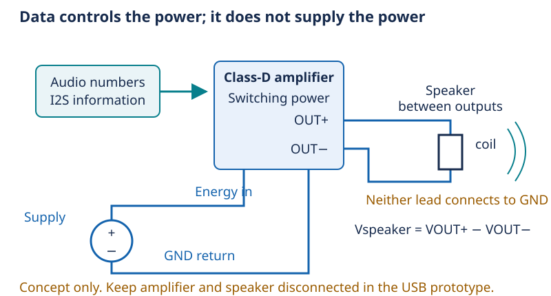

# Day 10 — Turning information into moving air

[Concept index](README.md) · [Day 10 lab](../DAILY_STUDY_AND_LAB_PLAN.md#day-10--class-d-btl-speaker-limits-and-the-audio-gate)

## The physical idea

Microphone data describes sound; it does not carry enough power to drive a
speaker. An amplifier draws energy from its supply and controls how that
energy reaches the speaker, following the audio signal.

In a moving-coil speaker, current in a coil interacts with a magnetic field
and produces force. The coil moves a diaphragm, which changes the surrounding
air pressure. Electrical resistance also turns some energy into heat. The
speaker therefore has electrical, mechanical, and thermal limits—not just a
maximum volume setting.



*Information chooses the motion; the supply pays its energy cost. This is a
conceptual future audio path, not today's wiring: leave the amplifier and
speaker disconnected in the beginner prototype.*

## The engineering idea: neither speaker lead is ground

A Class-D amplifier uses rapidly switching output transistors to control
power efficiently. Switching still causes losses, heat, and electrical noise.
The speaker's electrical and mechanical behavior responds mainly to the
audio-band part of that drive; “Class-D” does not mean the speaker moves only
between two positions.

**BTL**, or bridge-tied load, places the speaker between two actively driven
outputs:

```text
V_speaker = V_OUT+ − V_OUT−
```

For example, if those terminal voltages are 3 V and 1 V relative to circuit
ground at some instant, the speaker sees 2 V. Reversing the two voltages gives
−2 V. Neither terminal has to become negative relative to ground to reverse
the speaker's voltage.

Never ground either output or attach a grounded instrument clip to it. The
MAX98357A also requires valid audio clocks: losing WS while BCLK continues can
cause dangerous DC output. See the [manufacturer's datasheet](https://www.analog.com/media/en/technical-documentation/data-sheets/max98357a-max98357b.pdf).
Do not create powered clock-disconnection experiments.

## One small power example

Treating an 8 Ω speaker as a resistor **only for an estimate**:

```text
P = V_rms² / R
At 0.8 W: V_rms = √(0.8 × 8) ≈ 2.53 V across the speaker
```

RMS is the voltage with the same resistor-heating effect as that DC voltage.
Real speaker impedance varies with frequency; this result is neither a safe
volume setting nor permission to apply 2.53 V DC. A speaker's measured DC
resistance and its nominal AC impedance need not be equal.

## In your pocket prototype

You can learn these ideas with unpowered inspection and calculations while
the USB controller, OLED, and microphone remain useful. Default firmware keeps
the amplifier disabled. Audio power integration is a later, separately checked
step—not a prerequisite for learning or for microphone capture.

**Predict:** What happens to the resistive power estimate if RMS voltage
doubles?

<details>
<summary>Answer</summary>

Power becomes four times larger because voltage is squared. A small increase
in voltage can therefore make a large difference to heating.

</details>

For more: [Lesson 10 — Speakers, power, and acoustics](../../edu/fundamentals/10-class-d-btl-speakers-and-acoustics.md).
