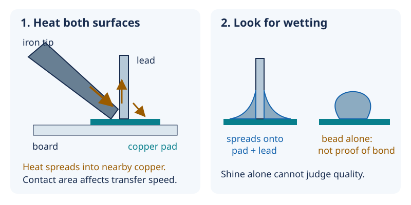

# 11 — Soldering: heat flow makes the connection

[Concept index](README.md) · [Day 11 lab](../DAILY_STUDY_AND_LAB_PLAN.md#day-11--soldering-practice-before-project-hardware)

**The idea:** soldering is controlled heating and surface bonding, not sticking
two cold objects together with a blob of metal.

## What the physics is doing

Heat is energy transferred because of a temperature difference. The hot iron
transfers energy into the cooler pad and component lead. They, in turn, lose
energy into the board and air. A large copper area carries heat away more
readily than a tiny isolated pad.

Temperature tells you how hot something is; it does not tell you how quickly
heat can enter the joint. A tiny contact can transfer heat slowly even when the
station displays a high temperature. A suitable chisel tip contacts both
surfaces and can heat them promptly. The station display is not a thermometer
inside your joint.



*Arrows show heat flow, not electric current. The joint shapes are simplified
cross-sections, not an appearance-only acceptance test.*

**Wetting** means molten solder spreads onto a solderable surface and bonds at
the interface. Oxide and dirt interfere. Electronics flux helps remove oxide
during heating; it cannot replace heating both workpieces. Letting a large
drop fall from the iron onto a cold pad can leave a weak connection underneath.

## A small energy example

For a solid warming without melting:

```text
heat energy ≈ mass × specific heat capacity × temperature rise
E = m × c × ΔT
```

For an illustrative copper piece, assume `m = 0.10 g`,
`c ≈ 0.39 J/(g·°C)`, and a `200 °C` rise:

```text
E ≈ 0.10 × 0.39 × 200 = 7.8 joules
```

Ten times as much copper needs about ten times the energy for the same rise.
Real soldering also heats other material and loses heat continuously, so this
is **not** a temperature or dwell-time recipe.

## Why it matters for your prototype

Practice on the Day 11 sacrificial wire/header samples, with project parts
unpowered and batteries absent. Use the lab's ventilation, eye protection,
electronics-flux, and hand-washing precautions. No extra parts are needed.

Look for wetting onto both surfaces, unintended bridges, damaged insulation,
and lifted pads. Then check continuity and adjacent-node isolation with power
absent. Shine alone is not quality: alloy affects appearance, and lead-free
joints can be sound without a mirror finish. More heat can damage the board
without fixing contamination or poor tip contact.

## Predict before reading

Two equal-temperature tips touch a large pad: one barely touches it; the other
has a broad, well-wetted contact. Which is likely to heat the joint sooner?

<details>
<summary>Answer</summary>

The broad contact usually transfers heat faster. That can shorten the time the
part spends being heated. Tip suitability and surface condition matter, not
just the temperature setting; verify the process on your practice samples.

</details>

Go deeper: [Lesson 12 — wetting, tip choice, and inspection](../../edu/fundamentals/12-soldering-mechanics-insulation-tolerance.md#a-joint-is-a-controlled-metallurgical-interface).
