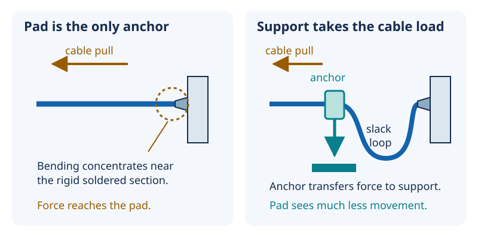

# 12 — Strain relief: give forces another path

[Concept index](README.md) · [Day 12 lab](../DAILY_STUDY_AND_LAB_PLAN.md#day-12--wire-joints-strain-relief-and-controlled-rework)

**The idea:** an electrical connection and a mechanical anchor have different
jobs. A wire can conduct perfectly today yet break after repeated movement.

## Force, stress, and strain

A **force** is a push or pull, measured in newtons (`N`). **Stress** describes
how concentrated an internal force is: for simple uniform tension,
`stress = force / cross-sectional area`. **Strain** is relative deformation:
`strain = change in length / original length`.

At a soldered wire, flexible strands become a comparatively rigid section.
Bending tends to concentrate near that transition. Repeated bending can grow
small cracks: this is **fatigue**, and it can happen without a single dramatic
tug. Solder that wicks farther up a stranded wire lengthens its rigid region;
it does not automatically make the assembly more durable.



*These arrows show mechanical force, not current. A support must actually hold
the cable; covering it is not enough.*

**Strain relief** transfers cable loads into a support before they reach the
delicate electrical joint. A supported cable jacket and a small service loop
let the connection remain relatively still. An insulating sleeve prevents
electrical contact; it is not necessarily an anchor. Heat-shrink can stiffen
and protect a splice, but bending can simply move to its edge.

## A lever example

A sideways force also produces a turning effect, called a **moment** or
**torque**:

```text
moment = force × perpendicular distance from the pivot
M = F × d
```

In a simplified rigid-lever model, a `1 N` force applied `20 mm` from a pad
produces `1 × 0.020 = 0.020 N·m`. Applied at `5 mm`, it produces
`0.005 N·m`: one quarter as much. Real flexible wires bend, so these are
illustrative values, not a pad's safe-load rating. The useful insight is to
intercept movement before a pad becomes the cable's pivot.

## Why it matters for your prototype

Use only Day 12's unpowered sacrificial samples for the gentle supported versus
unsupported comparison. Notice **where** bending occurs; do not try to break
a project module or pull the speaker's fine factory leads. Reserve wire slack
for unplugging and inspection instead of making every connection taut.

Rework is another heating cycle, not an unlimited undo button. After a practice
joint is restored, inspect for loosened pads, bridges, and damaged insulation;
repeat continuity and isolation checks with sources absent. A continuity beep
does not show fatigue resistance or prove a joint can carry substantial current.

## Predict before reading

A wire has heat-shrink over its soldered end but no anchor. Is the pad now
protected from an external cable pull?

<details>
<summary>Answer</summary>

Not necessarily. If the only force path still ends at the pad, the pad still
takes the pull. Insulation, local stiffening, and strain relief are related but
different functions. Look for the separate support that carries the load.

</details>

Go deeper: [Lesson 12 — wire support and insulation](../../edu/fundamentals/12-soldering-mechanics-insulation-tolerance.md#wires-need-mechanical-support).
