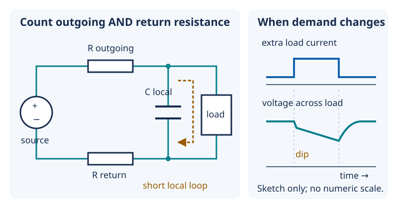

# 13 — Power integrity: a rail is not an ideal source

[Concept index](README.md) · [Day 13 lab](../DAILY_STUDY_AND_LAB_PLAN.md#day-13--power-integrity-without-a-battery)

**The idea:** a rail must deliver the right voltage *at the load*, including
when the load's current suddenly changes. A label saying `3V3` is a target,
not a guarantee.

## Follow both sides of the loop

A **rail** is a shared supply connection. Current leaves the source, passes
through loads, and returns through ground wiring. Real wires, connectors, and
contacts have resistance; a current creates voltage drops in both outgoing
and return paths. Fast changes also encounter **inductance**, the property that
opposes changes in current. Together, these effects contribute to **impedance**:
opposition to current that can depend on frequency.



*The capacitor is across the load, not in series. Right: illustrative timing,
not a measurement of your board.*

At a junction, KCL still applies. During a brief increase in demand:

```text
current into load = current from source + current from local capacitor
```

The capacitor's stored electric-field energy supports the rail temporarily.
Its voltage falls as it supplies charge; afterward, the source replenishes it.
A nearby capacitor makes the fast current loop short. It cannot replace a
source capable of supplying the long-term average load.

## Two paper calculations

First, assume an ideal `3.3 V` source and `0.50 Ω` total outgoing-plus-return
resistance. A sustained `0.20 A` load gives:

```text
path drop = I × R = 0.20 × 0.50 = 0.10 V
voltage across load = 3.30 − 0.10 = 3.20 V
```

Separately, suppose an ideal `100 µF` capacitor alone supplies an extra
`0.10 A` for `100 µs`:

```text
Q = C × V and I = ΔQ / Δt
so voltage decrease ΔV = I × Δt / C
ΔV = 0.10 × 0.000100 / 0.000100 = 0.10 V
```

These are simplified examples, not measured pager demands. Real behavior also
depends on capacitor resistance, inductance, wiring, and source response.
Do not blindly add these two examples into a single predicted waveform.

## Why it matters for your prototype

A multimeter reading near 3.3 V can miss brief dips. A reset log can provide a
clue; it does not measure the dip. Use existing diagnostics and the Day 13
resistor-load exercise, not a newly improvised amplifier load test.

Keep USB `5V`, regulated `3V3`, and possible battery power distinct. Regulation
sets voltage; current limiting limits current; charging manages a cell's charge;
source isolation controls unwanted current between supplies. None implies the
others. This lesson does not authorize joining supplies or connecting a cell.

## Predict before reading

If the same capacitor must supply the same current for twice as long, what
happens to its ideal voltage decrease?

<details>
<summary>Answer</summary>

It doubles because `ΔV = I × Δt / C`. A bigger capacitor can help temporarily,
but any finite capacitor eventually runs down under sustained demand.

</details>

Go deeper: [Lesson 06 — source impedance and decoupling](../../edu/fundamentals/06-li-ion-power-integrity-decoupling-uvlo-thermal.md#source-impedance-is-more-than-a-resistor).
