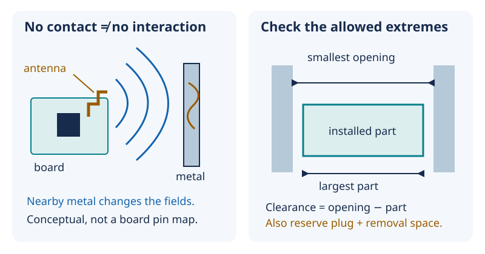

# 14 — Fit and radio: parts need space beyond their outlines

[Concept index](README.md) · [Day 14 lab](../DAILY_STUDY_AND_LAB_PLAN.md#day-14--rf-awareness-and-a-11-nonconductive-mock-up)

**The idea:** “the rectangles fit” is only the beginning. Real parts vary in
size, connectors need a path in and out, and antennas interact with nearby
materials without touching them.

## Fields are part of the hardware

An antenna turns rapidly changing electrical currents into electromagnetic
fields, and incoming fields into electrical signals. The antenna, its circuit
board, and its surroundings form a system. Metal nearby can carry induced
currents that change the antenna's behavior even when there is no direct
electrical connection.

An insulating film helps prevent a short; it does **not** make metal invisible
to radio. Metal can change the directions in which energy travels, the antenna's
tuning, and losses. Plastic and your hand can affect the fields too. Espressif
therefore calls for antenna clearance and final-product RF testing in its
[ESP32-C3 layout guidance](https://docs.espressif.com/projects/esp-hardware-design-guidelines/en/latest/esp32c3/pcb-layout-design.html#general-principles-of-pcb-layout-for-modules-positioning-a-module-on-a-base-board).



*Left: conceptual fields, not an antenna location map or a keepout dimension.
Right: check the smallest opening against the largest part.*

Do not copy a universal keepout distance from another board or derive it just
from wavelength. Identify the antenna on your exact received board and preserve
space to adjust the mock-up. An unpowered cardboard model can check geometry;
it cannot verify radio performance.

## Nominal size is not guaranteed clearance

A **nominal** dimension is the design target. A **tolerance** states permitted
variation. **Clearance** is the remaining space; negative clearance means the
parts interfere.

Assume an opening is `20.2 ± 0.2 mm` and a module is `20.0 ± 0.15 mm`:

```text
nominal clearance = 20.2 − 20.0 = 0.20 mm
smallest opening = 20.2 − 0.2 = 20.00 mm
largest module = 20.0 + 0.15 = 20.15 mm
worst-case clearance = 20.00 − 20.15 = −0.15 mm
```

The nominal drawing fits, but the allowed extremes do not. For stacked parts,
board thickness, headers, insulation, and lid variation also accumulate: a
**tolerance stack**. Caliper digits alone do not establish part tolerances or
measurement accuracy.

## Why it matters for your prototype

For Day 14, use owned paper/cardboard and measured parts. Include the USB plug,
insertion direction, cable bend, button travel, microphone opening, and part
removal—not just board bodies. Leave room for insulation and supported wires.

Keep the cell represented by an inert dummy and final metal fabrication held.
An open desk prototype is useful without a finished pocket case. No additional
parts or RF instrument purchase is required to learn these distinctions.

## Predict before reading

If the board cannot touch a metal lid because tape separates them, can you
conclude that Wi-Fi will behave as it did on the open bench?

<details>
<summary>Answer</summary>

No. Electrical isolation prevents direct contact, not field coupling. The lid
can still change radio behavior. RF confidence requires controlled, repeated
tests of the relevant geometry, not just an insulation check.

</details>

Go deeper: [Lesson 11 — antennas and nearby metal](../../edu/fundamentals/11-rf-emc-antennas-and-metal-frame.md) and [Lesson 12 — tolerances](../../edu/fundamentals/12-soldering-mechanics-insulation-tolerance.md#dimensions-are-distributions-not-perfect-numbers).
