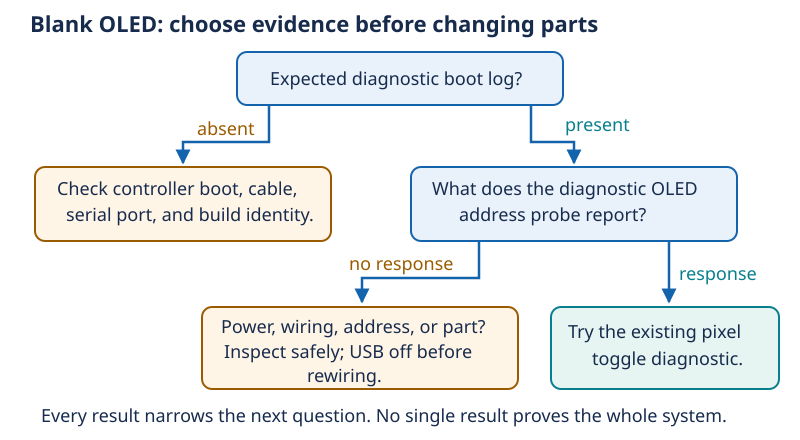

# 15 — Debugging: ask the next question that separates causes

[Concept index](README.md) · [Day 15 lab](../DAILY_STUDY_AND_LAB_PLAN.md#day-15--battery-free-integration-and-debugging-capstone)

**The idea:** debugging is experimental science on a small system. A symptom
is an observation; a cause is an explanation that must survive useful tests.

## Start with competing explanations

“The screen is blank” does not tell you whether the board booted, the OLED
answered on I²C, or software drew any pixels. Write two or three plausible
causes, then choose a safe observation that predicts different outcomes for
them. This is a **discriminating test**.

You already do this in software: checking whether a request reached the server
separates a network problem from application behavior. Here, boot logs, bus
acknowledgments, and pixel diagnostics expose different hardware layers.

*A probe acknowledgment means some device answered at that address. It does
not prove that the display pixels, timing margins, or every connection work.*

## A concrete debugging example

Suppose the controller logs its expected diagnostic version, but the OLED is
blank. Consider:

| Explanation | What would help distinguish it? |
| --- | --- |
| The OLED is not reachable on the bus | Diagnostic address-probe result |
| The display responds but has a pixel/configuration problem | The existing all-pixels toggle result |
| Different firmware or pins are in use | Printed build identity and the wiring map |

If a probe reports a response, total loss of bus connectivity becomes less
likely; that observation does not eliminate intermittent wiring or a wrong
display type. If an all-pixels toggle works, the panel can display under those
conditions. A later blank application screen is now more likely to involve
application state or content, but you still verify rather than guess.

Change one relevant thing, rerun the original failure test, and check the
previously working button/microphone behavior. Otherwise the “fix” may have
introduced a regression or merely coincided with a loose wire moving.

## Confidence is not universal proof

An observation has a scope: **this board, this firmware, this wiring, this
power source, these conditions**. Ten successful starts are better evidence
than one, but do not guarantee every temperature or future wire position.
An unmeasured fast voltage dip stays unknown even if the multimeter looks steady.

Save a small record: symptom → hypotheses → test → result → next conclusion.
Keep the last known-good wiring photo and serial transcript. A narrowly stated
pass is more useful than “everything works.”

## Why it matters for your prototype

Use Day 15's existing offline diagnostics and USB-only, amplifier-absent setup.
Disconnect USB before changing wires and keep all grounds intact. This page
adds reasoning, not new fault-injection exercises or battery tests. Isolating a
problem often costs no new parts; an unsupported measurement can simply remain
inconclusive.

## Predict before reading

You change three wires and rebuild firmware; the screen starts working. Have
you isolated the cause?

Answer

No. Several explanations fit the result. Save the working state, then use the
logs and safe, controlled comparisons to isolate the relevant difference.
Do not recreate an electrically unsafe state just to make the explanation
more certain.

Go deeper: [Lesson 13 — hypotheses and separating tests](../../edu/fundamentals/13-debugging-integration-and-capstone.md#hypotheses-and-discriminating-tests).
